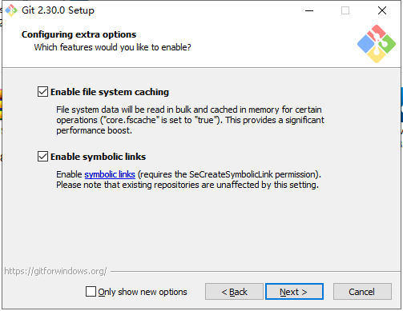
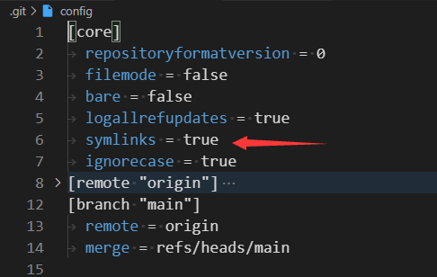

# Config-In-One
集中维护各种配置文件

## VSCode 路径备忘

> %USERPROFILE%\AppData\Local\Programs\Microsoft VS Code

## Git 使用 symlinks 的正确姿势

- 安装时开启下边选项

  

- `.git/config` 中开启「core.symlinks」

  

也可以使用命令行操作：

> git clone -c core.symlinks=true <URL>

## 其他

关于符号链接，可以看下边文章：

[合并了 Typecho 文章到 Z-Blog\_电脑网络\_沉冰浮水](https://www.wdssmq.com/post/20200905897.html "合并了Typecho文章到Z-Blog\_电脑网络\_沉冰浮水") ← 想吐槽自己每次标题和内容重点都不对应

